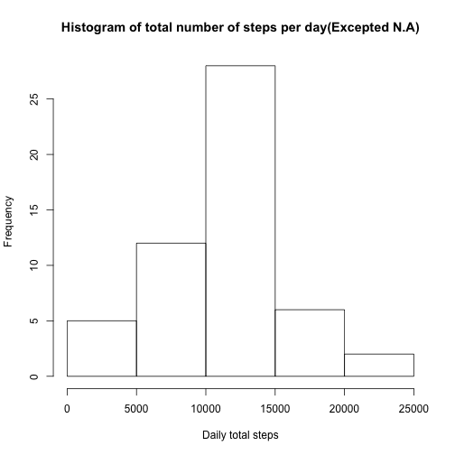
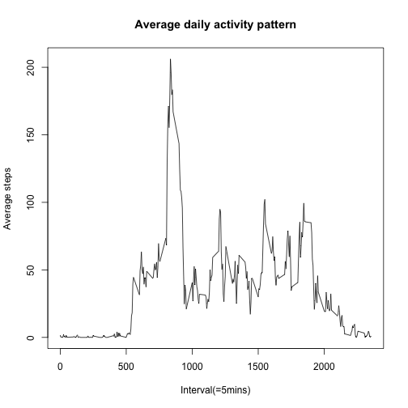
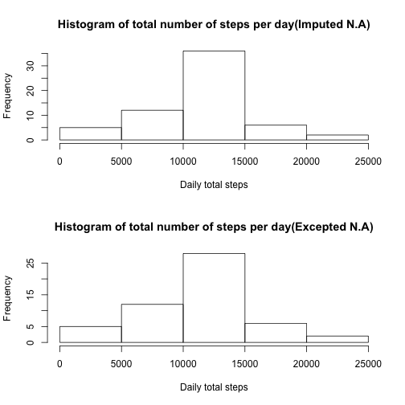
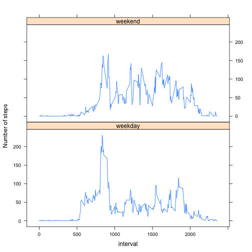

##Loading and preprocessing the data
- I maked data frame called "raw" and transformated the format of 'date' column to 'Date' format.

```r
dir <- getwd()
url <- "https://d396qusza40orc.cloudfront.net/repdata%2Fdata%2Factivity.zip"

#Downloading a data file
if(!file.exists(paste(dir, "./activity.csv", sep = ""))){
        download.file(url, destfile = "data.zip", method = "curl")
        unzip("data.zip")
}

#Q1. Loading and preprocessing the data
raw <- read.csv("activity.csv")
raw <- transform(raw, date = as.Date(raw$date))
```


##What is mean total number of steps taken per day?
- I used the 'dplyr' package to trim the data frame.

```r
if(!require(dplyr)){install.packages("dplyr")}
q2 <- group_by(raw, date) %>% summarise(daily.steps = sum(steps))

hist(q2$daily.steps, main = "Histogram of total number of steps per day(Excepted N.A)", xlab = "Daily total steps")
```

 

- The mean and median of the total number of steps taken per day are below.

```r
q2.mean <- mean(q2$daily.steps, na.rm = T)
q2.median <- median(q2$daily.steps, na.rm = T)

print(paste("Mean :", q2.mean, ", Median :", q2.median))
```

```
## [1] "Mean : 10766.1886792453 , Median : 10765"
```


##What is the average daily activity pattern?
- The histogram showing the activity pattern is below.

```r
q3 <- group_by(raw, interval) %>% summarise(average.steps = mean(steps, na.rm = T))

with(q3, plot(interval, average.steps, type = "l", main = "Average daily activity pattern", 
              xlab = "Interval(=5mins)", ylab = "Average steps"))
```

 

- The 5-minute interval that contains the maximum number of steps and the maximum number are below.

```r
q3[grep(max(q3$average.steps, na.rm = T), q3$average.steps), ]
```

```
## Source: local data frame [1 x 2]
## 
##   interval average.steps
## 1      835      206.1698
```


##Imputing missing values
- Below is the number of missing values in the 'steps' column of data.

```r
sum(is.na(raw$steps))
```

```
## [1] 2304
```

- Below is process of comparing difference with 'steps' data contained 'N.A' and 'steps' data with 'N.A' that has been replaced by averages of each interval.

```r
raw2 <- raw
for(i in q3$interval){
        raw2[is.na(raw2$steps) & raw2$interval == i, 1] <- round(q3[q3$interval == i, 2])
}

q4 <- group_by(raw2, date) %>% summarise(daily.steps = sum(steps))

par(mfrow = c(2, 1))
hist(q4$daily.steps, main = "Histogram of total number of steps per day(Imputed N.A)", xlab = "Daily total steps")
hist(q2$daily.steps, main = "Histogram of total number of steps per day(Excepted N.A)", xlab = "Daily total steps")
```

 

- The mean and median of the two data frame are below.

```r
q4.mean <- mean(q4$daily.steps)
q4.median <- median(q4$daily.steps)

result.table <- matrix(data = c(q2.mean, q2.median, q4.mean, q4.median), nrow = 2, ncol = 2, 
                       dimnames = list(c("Mean", "Median"), c("Excepted N.A", "Imputed N.A")))

print(result.table)
```

```
##        Excepted N.A Imputed N.A
## Mean       10766.19    10765.64
## Median     10765.00    10762.00
```


##What is the average daily activity pattern?
- I used the 'lattice' package to plot the data showing difference of activity pattern between weekdays and weekend.

```r
raw2 <- mutate(raw2, day = weekdays(date, abbreviate = T))
raw2[raw2$day == "Sat" | raw2$day == "Sun", 4] <- "weekend"
raw2[raw2$day != "weekend", 4] <- "weekday"

q5 <- group_by(raw2, interval, day) %>% summarise(average.steps = mean(steps))

if(!require(lattice)){install.packages("lattice")}

xyplot(average.steps ~ interval | day, q5, layout = c(1, 2), type = "l", ylab = "Number of steps")
```

 
